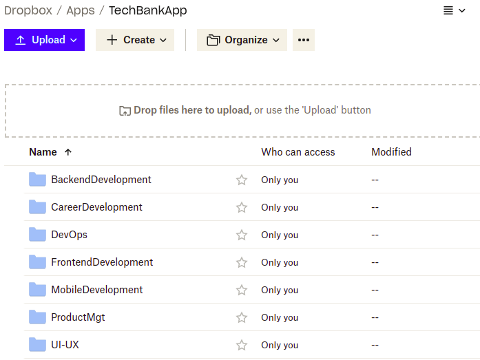

# Techbank App

## Author: Catherine Muthoni

Documentation Link: https://documenter.getpostman.com/view/18146738/2s93sZ6ZUG

### Description
TechBank is an open source resource pool for everything tech. Users can add and access resources on all tech topics. The resources are categorised into: Frontend Development, Backend Development, DevOps, UI-UX Design, Product Management, Career Development and Mobile Development.

This project is a REST API of the application built using Django and integrated with the Dropbox API.

An app was created on Dropbox and 7 folders representing the 7 categories of resources were created to hold the different resources.

### System Functional Requirements
- Uploading Resources: A user can upload a resource and assigns it to a category
- Retrieving all resources: A user can retrieve all uploaded resources
- Searching for a resource by category: A user can search for a resource by category
- Searching for a resource by name: User can search for a resource by typing in a search query

### Installation instructions
- Clone the repository
- Create a python virtual environment using pipenv
- Install required libraries using pipenv install
- Create a Dropbox application and create an app by the name "TechBank". Under the main app folder(TechBank), create 7 folders namely: 'FrontendDevelopment', 'BackendDevelopment', 'DevOps', 'UI-UX', 'ProductMgt', 'CareerDevelopment', 'MobileDevelopment'. These are the folders that will hold the different categories of resources. For more information on how to create a Dropbox app, refer to the documentation [here](https://www.dropbox.com/developers/documentation/python#tutorial). Your app should look like this:

- Create a .env file in root directory and add a variable to hold the app token .ie.
DBX_ACCESS_TOKEN = '*your token*'
- Run 'python manage.py runserver' to start the server on your local machine
- Run 'python manage.py test resources' to run the tests

### Technologies used
- Python
- Django
- Django Rest Framework
- Dropbox Python SDK

